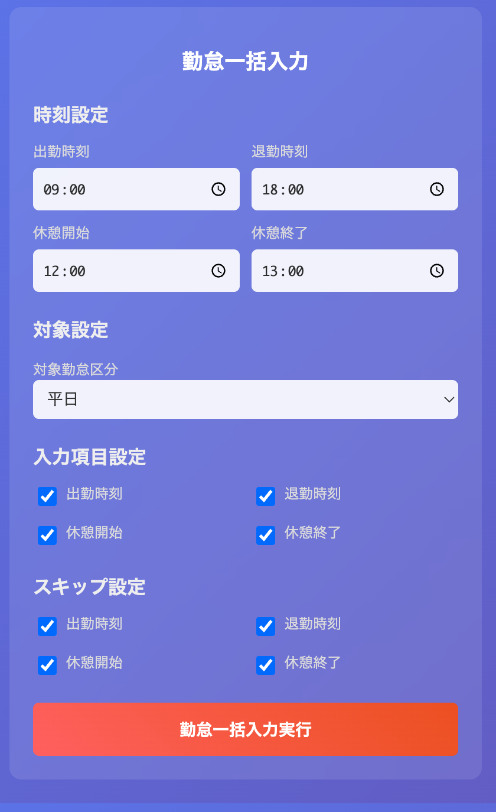

# Kintai Helper - 勤怠入力支援 Chrome拡張機能


勤怠管理システムの一括入力画面で勤怠データを効率的に入力できるChrome拡張機能です。特にMoney Forward クラウド勤怠での動作を確認しています。TypeScriptで開発され、DOM解析とブラウザ自動操作により月次勤怠入力の作業時間を大幅に短縮します。

## 📸 スクリーンショット



シンプルなUIで直感的に勤怠データの一括入力設定が可能です。

## ⚠️ 重要な注意事項

- **非公式ツール**: この拡張機能は各勤怠管理システムの提供元とは一切関係のない非公式ツールです
- **自己責任**: 使用は完全に自己責任でお願いします
- **利用規約遵守**: ご利用の勤怠管理システムの利用規約に違反しないよう注意してください
- **データバックアップ**: 重要な勤怠データは事前にバックアップを取ることを強く推奨します

## 🌟 主な機能

- **項目別入力制御**: 出勤・退勤・休憩開始・休憩終了の各項目を個別に制御
- **既存データスキップ**: 既に入力されているデータをスキップする機能
- **シンプルなUI**: グラデーションカラーを使用したモダンなポップアップデザイン
- **設定の永続化**: 設定をChromeストレージに自動保存
- **詳細ログ出力**: 処理状況をリアルタイムで確認
- **タイミング問題解決**: 動的DOM対応とイベント発火による高い信頼性

## 🚀 インストール

### 方法1: ソースコードからインストール（推奨）

#### 1. リポジトリをダウンロード
```bash
# Gitでクローン
git clone https://github.com/jaganoer-works/kintai-helper-extension.git

# またはZIPダウンロード
# GitHubページの「Code」ボタン → 「Download ZIP」
```

#### 2. 依存関係のインストールとビルド
```bash
cd kintai-helper-extension
npm install
npm run build
```

#### 3. Chromeに拡張機能を追加
1. Chromeブラウザで `chrome://extensions/` を開く
2. 右上の「デベロッパーモード」をONにする
3. 「パッケージ化されていない拡張機能を読み込む」をクリック
4. ダウンロードしたフォルダ（`kintai-helper-extension`）を選択
5. 拡張機能が追加されたことを確認

### 方法2: ビルド済みファイルを使用

1. [Releases](https://github.com/jaganoer-works/kintai-helper-extension/releases)から最新版をダウンロード（提供予定）
2. ZIPファイルを解凍
3. 上記の「Chromeに拡張機能を追加」の手順3-5を実行

## 📖 使用方法

### 1. 前提条件
- 対応する勤怠管理システムのアカウントを持っていること
- Chrome ブラウザを使用していること
- 勤怠の一括入力権限があること

### 2. 基本的な使用手順

#### ステップ1: 勤怠管理システムにログイン
1. ブラウザで勤怠管理システムにアクセス
   - 例: Money Forward クラウド勤怠 (https://attendance.moneyforward.com/)
2. アカウントでログイン

#### ステップ2: 一括入力画面を開く
1. メニューから「勤怠」を選択
2. 「一括入力」または「月次勤怠入力」画面を開く
3. 対象の年月を選択

#### ステップ3: 拡張機能を起動
1. ブラウザの拡張機能アイコン（パズルピースマーク）をクリック
2. 「Kintai Helper」拡張機能をクリック
3. ポップアップウィンドウが表示される

#### ステップ4: 設定を調整
ポップアップ画面で以下を設定：
- **時刻設定**
  - 出勤時刻（例: 09:00）
  - 退勤時刻（例: 18:00）
  - 休憩開始時刻（例: 12:00）
  - 休憩終了時刻（例: 13:00）
- **対象設定**
  - 対象勤怠区分（平日/所定休日/法定休日）
- **入力項目**
  - 各項目の入力有無をチェックボックスで選択
- **既存データのスキップ**
  - 既に入力済みのデータをスキップするか選択

#### ステップ5: 実行
1. 「勤怠一括入力実行」ボタンをクリック
2. 自動的に入力が開始される
3. 処理完了まで待機（ページを閉じない）

#### ステップ6: 結果確認
1. ブラウザのコンソール（F12キー）で詳細ログを確認
2. 入力された値を画面で確認
3. 必要に応じて手動で修正

### 3. 設定オプション詳細

#### 時刻設定
- **出勤時刻**: デフォルト 09:00
- **退勤時刻**: デフォルト 18:00  
- **休憩開始**: デフォルト 12:00
- **休憩終了**: デフォルト 13:00

#### 入力制御
- 各項目（出勤・退勤・休憩開始・終了）の入力有無を個別設定
- 既存データがある場合のスキップ設定

## 🏗️ プロジェクト構成

```
kintai-helper-extension/
├── src/
│   ├── types/
│   │   └── index.ts              # 型定義
│   ├── utils/
│   │   └── logger.ts             # ログ出力機能
│   ├── services/
│   │   └── attendanceService.ts  # メインロジック
│   ├── content.ts                # コンテンツスクリプト
│   ├── background.ts             # バックグラウンド処理
│   └── popup.ts                  # ポップアップ処理
├── dist/                         # ビルド出力
├── manifest.json                 # 拡張機能設定
├── popup.html                    # UI
└── webpack.config.js             # ビルド設定
```

## 🛠️ 開発

### 必要要件

- Node.js 16+
- Chrome/Chromium ブラウザ

### 開発環境セットアップ

```bash
# 依存関係のインストール
npm install

# 開発モード（ファイル監視）
npm run dev

# プロダクションビルド
npm run build
```

### 開発ワークフロー

1. コードを修正
2. `npm run dev` でビルド
3. Chrome拡張機能を再読み込み
4. テスト実行

## 🧪 テスト

現在手動テストで品質を確保しています。自動テストフレームワークの導入を検討中です。

### テスト手順

1. 各種勤怠管理システムのレイアウトで動作確認
2. 異なる勤怠区分での動作テスト
3. 既存データがある状態でのスキップ機能テスト

## 🔧 技術スタック

- **TypeScript**: 型安全性と開発効率
- **Chrome Extension API v3**: モダンな拡張機能開発
- **Webpack**: モジュールバンドリング
- **Chrome Storage API**: 設定永続化

## 🤖 AI開発支援ツール

このプロジェクトは以下のAIツールを活用して開発されています：

- **Claude Code**: コードレビュー、リファクタリング、ドキュメント作成
- **Cursor**: AI支援によるコード補完と実装
- **TypeScript**: 型安全性による開発効率の向上

AIツールの活用により、高品質で保守性の高いコードベースを効率的に構築しています。

## 🤝 コントリビューション

プルリクエストやイシューの投稿を歓迎します！

### コントリビューションガイドライン

1. Issueで改善提案や バグ報告
2. フォークしてフィーチャーブランチを作成
3. コードの品質を保つため型チェックを実行
4. プルリクエストを作成

### 開発時の注意点

- TypeScriptの型チェックを必ず実行
- コンソールエラーが出ないことを確認
- 各種勤怠管理システムの画面でテスト
- 利用規約に違反しないよう機能設計を慎重に

## 📋 対応システム

様々な勤怠管理システムに対応しています:

- 標準的なテーブルレイアウト
- Money Forward クラウド勤怠での動作を確認済み
- 動的に生成される勤怠入力フィールド
- 各種勤怠区分（平日、所定休日、法定休日）への対応

## ⚡ タイミング問題への対応

### 解決済みの問題

- DOM動的生成への対応
- 非同期UIフレームワーク対応
- イベント発火による確実な値設定
- MutationObserver活用による要素待機

## 🐛 トラブルシューティング

### よくある問題と解決方法

#### 拡張機能アイコンが表示されない
**原因**: 拡張機能が正しくインストールされていない
**解決方法**:
1. `chrome://extensions/` を開く
2. 拡張機能が有効になっているか確認
3. 無効の場合は右下のトグルをONに
4. ブラウザを再起動

#### ポップアップが開かない
**原因**: ページの読み込みが完了していない
**解決方法**:
1. ページを完全にリロード（Ctrl/Cmd + R）
2. 数秒待ってから拡張機能アイコンをクリック

#### 「勤怠データが見つかりません」エラー
**原因**: 正しいページにいない
**解決方法**:
1. 勤怠管理システムの一括入力画面であることを確認
2. 月次の勤怠データが表示されているか確認
3. 別の月に移動して再度試す

#### 値が入力されない
**原因**: DOM構造の変更またはタイミング問題
**解決方法**:
1. F12でコンソールを開き、エラーメッセージを確認
2. ページをリロードして再実行
3. 既存データのスキップ設定を確認
4. 時刻の形式が正しいか確認（HH:MM形式）

#### 一部の行だけ処理されない
**原因**: 対象勤怠区分の設定ミス
**解決方法**:
1. ポップアップで対象勤怠区分を確認
2. 「平日」「所定休日」「法定休日」の適切な選択
3. 詳細ログで該当行の勤怠区分を確認

### デバッグ方法

1. **コンソールログの確認**
   - F12キーでデベロッパーツールを開く
   - 「Console」タブを選択
   - エラーメッセージや処理ログを確認

2. **詳細ログの有効化**
   - ポップアップで「詳細ログを表示」にチェック
   - より詳細な処理状況を確認可能

3. **手動での要素確認**
   ```javascript
   // コンソールで実行して要素を確認
   document.querySelectorAll('input[type="text"]')
   ```

## 📄 ライセンス

MIT License - 詳細は[LICENSE](LICENSE)ファイルを参照

## 🔄 更新履歴

### v1.0.0 (2025-01-11)
- 勤怠管理システム対応の初回安定版リリース
- Money Forward クラウド勤怠での動作確認済み
- TypeScript版Chrome拡張機能として完全動作
- 項目別入力制御機能
- 既存データスキップ機能  
- タイミング問題解決済み
- シンプルなUIデザイン
- 設定の永続化対応
- Chrome Extension API v3対応

## 📞 サポート

- 🐛 バグ報告: [Issues](https://github.com/jaganoer-works/kintai-helper-extension/issues)
- 💡 機能提案: [Issues](https://github.com/jaganoer-works/kintai-helper-extension/issues)  
- 📧 その他の問い合わせ: Issues経由でお願いします

**注意**: 各勤怠管理システムの提供元への直接の問い合わせはご遠慮ください。このツールは非公式であり、各社とは一切関係ありません。

---

⭐ このプロジェクトが役に立ったら、ぜひスターをお願いします！

## 免責事項

- この拡張機能の使用により生じた如何なる損害についても、開発者は一切の責任を負いません
- 勤怠管理システムの仕様変更により、予告なく動作しなくなる可能性があります
- 使用前に必ずテスト環境での動作確認を行ってください